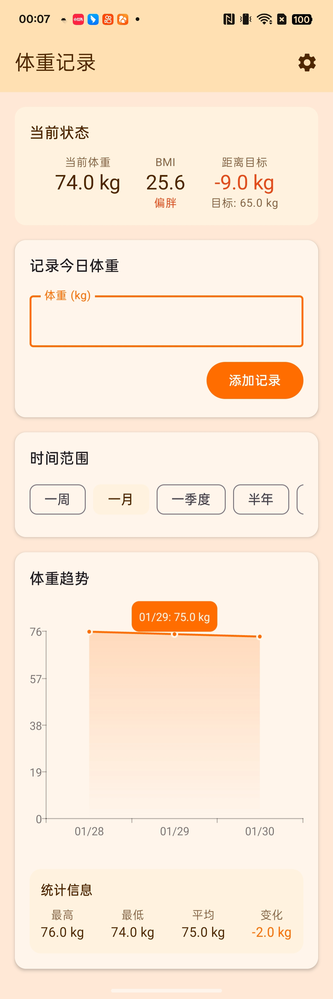

# WeightLoss - 体重记录助手

一款简洁美观的 Android 体重记录应用，帮助你追踪体重变化，实现健康目标。

[](https://github.com/kaixuangh/WeightLoss/releases/latest)

## 功能特性

- **体重记录** - 每日记录体重，同一天多次输入自动覆盖
- **趋势图表** - 可视化展示体重变化趋势，支持多时间范围查看
- **目标管理** - 设置目标体重，实时显示距离目标的差距
- **BMI 计算** - 根据身高自动计算 BMI 指数，显示健康状态
- **每日提醒** - 自定义提醒时间，养成每日记录习惯
- **单位切换** - 支持 kg / 斤 两种单位自由切换
- **深色模式** - 自动适配系统深色/浅色主题

## 截图

<p align="center">
  
</p>

## 技术栈

- **语言**: Kotlin
- **UI**: Jetpack Compose + Material Design 3
- **架构**: MVVM
- **数据库**: Room
- **偏好存储**: DataStore
- **图表**: Vico
- **定时任务**: WorkManager

## 环境要求

- Android Studio Hedgehog (2023.1.1) 或更高版本
- JDK 17
- Android SDK 24+ (Android 7.0)
- Gradle 8.x

## 构建运行

1. 克隆项目
```bash
git clone https://github.com/yourusername/WeightLoss.git
cd WeightLoss
```

2. 使用 Android Studio 打开项目

3. 同步 Gradle 依赖

4. 运行到设备或模拟器

### 命令行构建

```bash
# Debug 版本
./gradlew assembleDebug

# Release 版本
./gradlew assembleRelease
```

构建产物位于 `app/build/outputs/apk/` 目录。

## 项目结构

```
app/src/main/
├── java/com/kaixuan/weightloss/
│   ├── MainActivity.kt              # 主 Activity
│   ├── WeightViewModel.kt           # ViewModel
│   ├── data/
│   │   ├── UserSettings.kt          # 用户设置 (DataStore)
│   │   ├── WeightDao.kt             # 数据库 DAO
│   │   ├── WeightDatabase.kt        # Room 数据库
│   │   └── WeightRecord.kt          # 体重记录实体
│   ├── reminder/
│   │   └── ReminderWorker.kt        # 每日提醒
│   └── ui/
│       ├── SettingsScreen.kt        # 设置页面
│       ├── WeightChart.kt           # 体重图表
│       ├── WeightScreen.kt          # 主页面
│       └── theme/                   # 主题配置
└── res/                             # 资源文件
```

## 贡献指南

欢迎提交 Issue 和 Pull Request！

1. Fork 本仓库
2. 创建特性分支 (`git checkout -b feature/AmazingFeature`)
3. 提交更改 (`git commit -m 'Add some AmazingFeature'`)
4. 推送到分支 (`git push origin feature/AmazingFeature`)
5. 提交 Pull Request

## 开源协议

本项目基于 [MIT License](LICENSE) 开源。

## 致谢

- [Jetpack Compose](https://developer.android.com/jetpack/compose)
- [Vico](https://github.com/patrykandpatrick/vico) - Android 图表库
- [Material Design 3](https://m3.material.io/)
